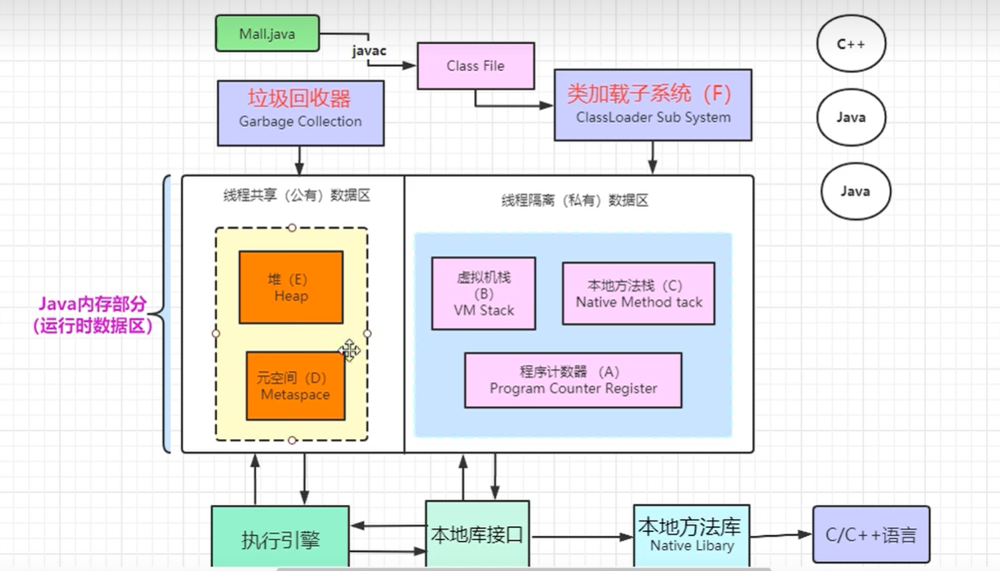
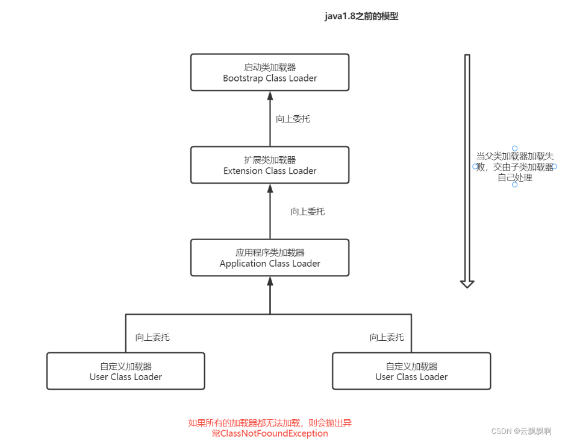
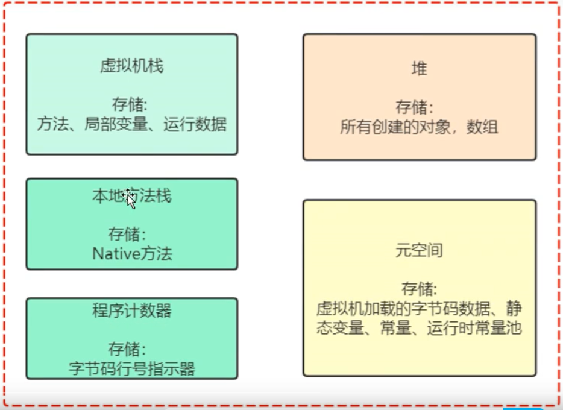
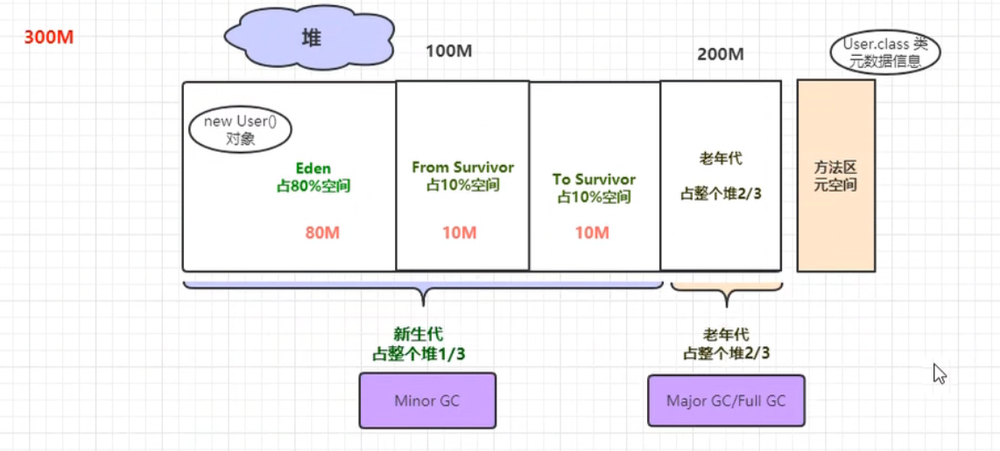
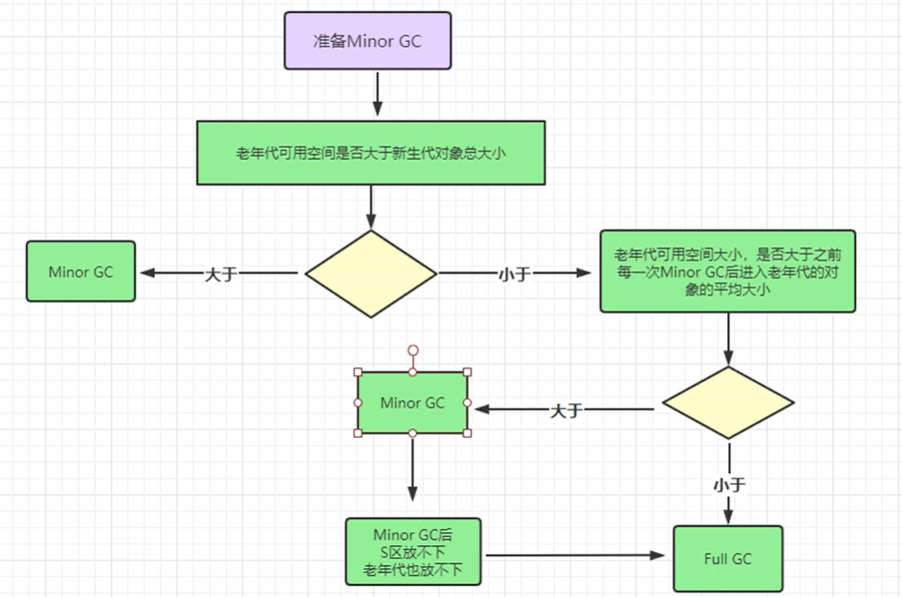
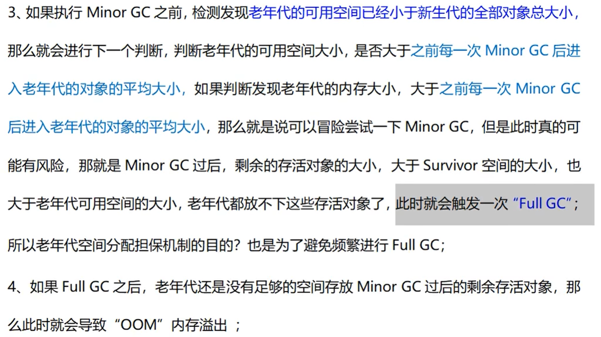

# JVM学习笔记
- 
## 双亲委派机制
- 目的
    - 安全
- 内容
    - 例如自己写了一个java.lang.String类，在里面写main方法时，会提示找不到main方法。原因是因为双亲委派机制会逐步向上找，通过APP(应用程序加载器)->EXTEND(扩展类加载器)->BOOTSTRAP(启动类(根)加载器)逐级向上找其他地方有没有String类
    - 步骤
        1. 类加载器收到类加载的请求
        2. 将这个请求向上委托给父类加载器去完成，一直向上委托，直到启动类加载器
        3. 启动加载器检查是否能够加载当前这个类，能加载就结束，使用当前的加载器，如果都找不到，就抛出异常，通知子加载器进行加载。
        4. 重复步骤3
    - 百度解释(1.8以及之前版本)
    ```
    如果一个类加载器收到了类加载请求，它首先不会自动去尝试加载这个类，而是把这个类委托给父类加载器去完成，每一层依次这样，因此所有的加载请求都应该传送到顶层的启动类加载器中，只有当父类加载器反馈自己无法完成该加载请求（找不到所需的类）时，这个时候子加载器才会尝试自己去加载，这个过程就是双亲委派机制！
    ```
    
- 优势
    1. 避免了类的重复加载
    2. 保护了程序的安全性，防止核心API被修改
- native关键字
    - 告诉JVM调用的方法是在外部定义，理解为Java去调用C/C++语言编写的程序
    - 带native关键字的方法会进入本地方法栈，调用本地方法接口(JNI/Java Native Interface)，以此扩展Java的使用，融合不同的编程语言给Java使用
- 如何定义自己的类加载器
    1. 继承ClassLoader
    1. 覆盖findClass(String name)方法 或者 loadClass()方法
        - findClass(String name)方法 不会打破双亲委派
        - loadClass()方法 可以打破双亲委派
- ClassLoader中loadClass(),findClass(),defineClass()的区别
    - loadClass()
        - 主要进行类加载的方法，默认的双亲委派机制就实现在这个方法中
    - findClass()
        - 根据名称或位置加载.class字节码。不想打破双亲委派就重写这个
    - defineClass()
        - 把字节码转化为Class

## 1.8以后的jvm内存结构
- 
- 左边是**线程私有的区域**，右边是**线程共享的区域**
- 程序执行过程
    ```java
    public class Application{
        public static void main(String[] args){
            load();
            System.in.read(); //程序不要退出
        }
        public static void load(){
            Config config = new Config();
            config.loadData();
        }
    }
    ```
    ```java
    public class Config{
        public static Manager manager = new Manager();
        private int a;
        public String loadData(){
            return "abc";
        }
    }
    ```
    - 
    - 先会加载Application类到元空间，再把main方法压入栈顶，在压入load()方法，加载Config类及其静态变量Manager到元空间，加载config对象和Manager到堆，压入config变量地址到栈，在压入loadData()方法到栈。
    - 逐个弹出栈并执行
- **程序计数器**的特点以及作用
    1. 是一块较小的内存空间，几乎可以忽略
    1. 是当前线程所执行的字节码的**行号指示器**
    1. Java多线程执行时，每条线程都有一个独立的程序计数器，各条线程纸巾之间计数器互不影响
    1. 该区域是“线程私有”的内存，每个线程独立存储
    1. 该区域不存在OutOfMemoryError
    1. 无GC回收
- JVM运行时数据区 **虚拟机栈**的特点以及作用
    - 
    - 组成
        1. 局部变量表
            - 数组结构
            - 存放基本类型，引用类型在堆中的地址，或者是方法的返回地址等
        2. 操作数栈
            - 栈结构
            - 需要计算的时候会在这里进行
            - 存放计算过程中的中间结果，同时作为计算过程中的变量临时的存储空间
        3. 动态链接
            - 一个方法里面如果调用了其他方法，动态链接就是存放其他方法的地址
        4. 返回地址
            - 不管方法有没有执行成功都会有一个返回，指明返回到哪里去
    - 特点
        1. 线程私有
        2. 方法执行会创建栈帧，存储局部变量表等信息
        3. 方法执行入虚拟机栈，方法执行完出
        4. 栈深度大于虚拟机所允许——StackOverflowError
        5. 栈需扩展而无法申请空间——OutOfMemoryError(Hotspot虚拟机没有)
        6. 栈里面运行方法，存放方法的局部变量名，变量名所指向的值(常量值、对象值等)都存到堆上的
        7. 栈一般不设置大小，因为所占空间其实很小，可以通过-Xss1M/-Xss128k进行设置，不设置默认为1M
        8. 随线程而生，随线程而灭
        9. 该区域不会有GC回收
- JVM运行时数据区 **本地方法栈**的特点以及作用
    1. 与虚拟机栈基本类似，区别在于本地方法栈为Native方法服务
    2. HotSpot虚拟机将虚拟机栈和本地方法栈**合并**。说的时候有这两个概念，但是区域划分实际上是合在一起的
    3. 有栈深度大于虚拟机所允许——StackOverflowError和OutOfMemoryError(少见)
    4. 随线程而生，随线程而灭
    5. CG不会回收该区域
- JVM运行时数据区 **Java堆(Heap)**的特点以及作用
    - 
    1. 线程共享
    2. 虚拟机启动时创建
    3. 虚拟机所管理的内存中最大的一块区域
    4. 存放所有实例对象或数组
    5. GC垃圾收集器的主要管理区域
    6. 可分为新生代、老年代
    7. 新生代更细分为Eden,From Survivor,To Survivor,Eden:From Survivor:To Survivor = 8:1:1
    8. 可通过-Xmx,-Xms调解堆大小
    9. 无法再扩展的话会报OutOfMemoryError:Java heap space
    10. 如果从分配内存的角度看，所有线程共享的Java堆中可以划分出多个线程私有的分配缓冲区(Thread Local Allocation Buffer, **TLAB**)，以提升对象分配时的效率(并发时避免锁的等待和冲突，先放缓冲区，放满了再放公共区)
- JVM运行时数据区 **元空间**的特点及作用
1. 在JDK1.8开始才出现元空间的概念，之前叫方法区/永久代
2. 元空间与Java堆类似，是线程共享的内存区域
3. 存储被加载的类信息，常量，静态变量，常量池，即时编译后的代码等数据
4. 元空间采用的是本地内存，本地内存有多少剩余空间，他就能扩展到多大空间，也可以设置元空间大小
5. 元空间很少有GC垃圾收集，一般该区域回收条件苛刻，能回收的信息比较少，所以GC很少来回收
6. 元空间内存不足时将抛出OutOfMemoryError
## JVM中对象如何在堆内存分配
  1. 指针碰撞(Bump The Pointer) 
    - 内存规整的情况下
    - 指针指向一个地方代表当前位置往前的内存空间已满，放对象的话要从这个位置开始往后放，同时指针往后移
  2. 空闲列表(Free List)
    - 内存不规整的情况下
    - 有一块地方记录哪些内存地址是空的，放对象的时候从列表里找一个
  3. 本地线程分配缓冲(Thread Local Allocation Buffer, **TLAB**)
    - 对象创建在虚拟机中频繁发生，即使仅仅修改一个指针指向的位置，在并发情况下也是线程不安全的，可能出现正在给对象分配内存，指针还没来得及修改，对象B又同时使用了原来的指针来分配内存的情况
      - 解决方案
        1. 同步锁定
           - JVM是采用CAS配上失败重试的方法保证更新操作的原子性
        2. 线程隔离
           - 把内存分配的动作按照线程划分在不同的空间之中进行，即每个线程在Java堆中预先分配一小块内存，成为本地线程分配缓冲(Thread Local Allocation Buffer)，哪个线程要分配内存，就在哪个线程的本地缓冲区中分配，只有本地缓冲区用完了，分配新的缓存区时才需要同步锁定
## JVM堆内存中的对象布局
  - HotSpot虚拟机中，一个对象的存储结构分为3块区域
    - 对象头(Header)
        - 第一部分用于存储对象自身运行时的数据
        - 第二部分是类型指针，即对象指向它的类的元数据指针，虚拟机通过这个指针确定这个对象是哪个类的实例
    - 实例数据(Instance Data)
      - 程序代码中所定义的各种成员变量类型的字段内容
    - 对齐填充(Padding)
      - 不是必然需要，主要是占位，保证对象大小是某个字节的整数倍(HotSpot中任何对象大小是8字节的整数倍)
- 内存分析工具有MAT工具、阿里巴巴的工具等
## JVM如何判断对象可以被回收
  - 通过可达性分析算法(Reachability Analysis)
    - 通过一系列称为"GC Roots"的根对象作为起始节点，从这些节点开始，根据引用关系向下搜索，搜索过程所走过的路径称为"引用链"(Reference Chain)，如果某个对象到GC Roots间没有任何引用链相连(不可达)，则证明此对象是不可能再被使用的对象，就被回收
## Java中不同的引用类型
- 引用类型
  - 强引用
    - Object o = new Object();
  - 软引用
    - SoftReference 内存充足时不回收，内存不足时回收
  - 弱引用
    - WeakReference 不管内存是否充足，只要GC一运行就会回收该引用对象
  - 虚引用
    - PhantomReference 形同虚设的引用，引用对象被回收时触发一个系统通知或者处理
## JVM堆内存分代模型
- 大部分对象朝生夕死，少数对象长期存活
- 新生代——占整个堆1/3
  - Eden
    - 占80%空间
  - From Survivor
    - 占10%空间
  - To Survivor
    - 占10%空间
- 老年代——占整个堆2/3
  - 经过15次回收之后进入老年代
- 回收机制
  - Eden里存放新对象，满了之后不能回收的放入From Survivor，Eden清除，然后Eden继续存放新对象，满了之后一起检查Eden和From Survivor，不可回收的放入To Survivor，清除Eden和From Survivor。Eden继续存放新对象，满了之后检查Eden和To Survivor，不可回收的放入From Survivor，清除Eden和To Survivor。以此类推循环，回收15次以上的放入老年代
  - 但并不一定必须15次以上才进入老年代，动态年龄判断触发时，Survivor区的对象年龄从小到大进行累加，年龄1+2+3的占比总和大于50%那么比3岁大的都会晋升到老年代。（也就是前面太多的情况下）
## 老年代空间分配担保机制
- 
- 
- 
## 综合-什么情况下对象会进入老年代
1. 15次GC之后，或者根据自己情况设置的
2. 动态对象年龄判断
3. 老年代空间担保机制
4. 大对象直接进入老年代
## 堆为什么要分成新生代和老年代
- 因为新生代和老年代不同的特点，需要采用不同的垃圾回收算法
- 新生代——创建之后很快就会被回收
- 老年代——需要长期存活
- 有了这两个划分之后，垃圾收集器可以每次只回收其中某一个或者某些部分的区域，同时也有了"Minor GC""Major GC""Full GC"这样的回收类型划分
  - Minor GC/Young GC:新生代收集
  - Major GC/Old GC:老年代收集
  - Full GC:整堆收集，收集整个Java堆和元空间/方法区的垃圾收集
  - Mixed GC:混合收集，收集整个新生代以及部分老年代的垃圾收集，目前只有G1收集器有这种行为
## 为什么有两个Survivor区
- 如果没有，一次Minor GC直接老年代，再满就触发Full GC，性能损耗大
- 如果有一个，和没有区别不大，Eden满了到S1，Minor GC之后Eden若又满了，还是直接到老年代。但是有两个就不同，S0、S1可以来回倒，复制算法效率提高不少。
## JVM中的垃圾回收算法
1. 标记-清除算法
2. 
3. 标记-整理算法
## 方法区（1.8以前）
- 定义
    - 方法区是被所有线程共享，所有字段和方法字节码，以及一些特殊方法，如构造函数，接口代码也在此定义，简单说，所有定义的方法的信息都保存在该区域，**此区域属于共享区间**
    - 静态变量，常量，类信息，运行时的常量池存在方法区中，但是实例变量存在堆内存中，和方法区无关。[Static,final,Class,常量池]
## 栈
- 栈帧是最小单位，用来表达方法与方法之间的调用关系，是一种高效的内存管理手段
- 组成
    1. 局部变量表(Local Variables)
        - 数组结构
        - 存放基本类型，引用类型在堆中的地址，或者是方法的返回地址等
    1. 操作数栈(Operand Stacks)
        - 栈结构
        - 存放计算过程中的中间结果，同时作为计算过程中的变量临时的存储空间
    1. 动态链接(Dynamic Linking)
        - 一个指向运行时常量池中该栈帧所属方法的引用
    1. 方法出口(分为Normal Method Invocation Completion 和 Abrupt Method Invocation Completion)
        - 记录方法结束后，继续运行下一个栈帧对应的哪个方法的哪行代码
- 1+1的执行过程
    ```java
    public class JVMTest {
    public int add(int a, int b){
        return a+b;
    }
    public static void main(String[] args) {
        int a = 1;
        int b = 1;
        System.out.println(new JVMTest().add(a,b));

    }

    }
    ```
    1. 首先进行构造方法、常量等方法的初始化
    1. 轮到main，先把a和b赋值
    1. getstatic 从类中获取静态字段
    1. new实例化对象
    1. dup操作数栈管理
    1. 调用init方法
    1. 传参a,b然后调用add方法
    1. 返回

## 知识整理区块
### 类加载相关
- 类加载的生命周期
    - 字节码->类加载->链接(验证->准备->解析)->初始化->使用->卸载
    - 类加载会把类的信息加入到方法区(元空间)
- 加载一个类采用Class.forName()和ClassLoader有什么区别
    - Class.forName得到的class是已经初始化完成的
    - CLassloader.loaderClass得到的class是还没有初始化的
- 为什么Tomcat要破坏双亲委派模型
    1. 部署在同一个Tomcat上的两个Web应用所使用的Java类库要互相隔离
    1. 部署在同一个Tomcat上的两个Web应用所使用的Java类库要相互共享
    1. 保证Tomcat服务器自身的安全不受部署的Web应用程序影响
    1. 需要支持JSP页面的热部署和热加载
### Java代码的运行过程
    1. Test.java -> javac -> Test.class -> java -> jvm里运行
# 未完待续