# RabbitMQ交换机模式配置
## Fanout模式(广播模式)

- 简单理解

  - 一个消息能被多个队列接受，多个队列接受的是同一个生产者的消息。转发消息最快，不处理路由键。

- 核心代码

  - Config里准备队列和交换机

    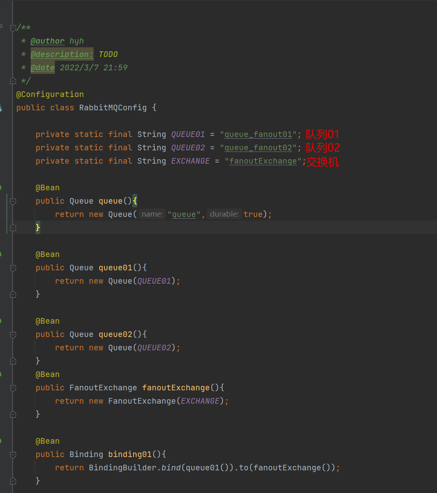

  - Config里绑定交换机

    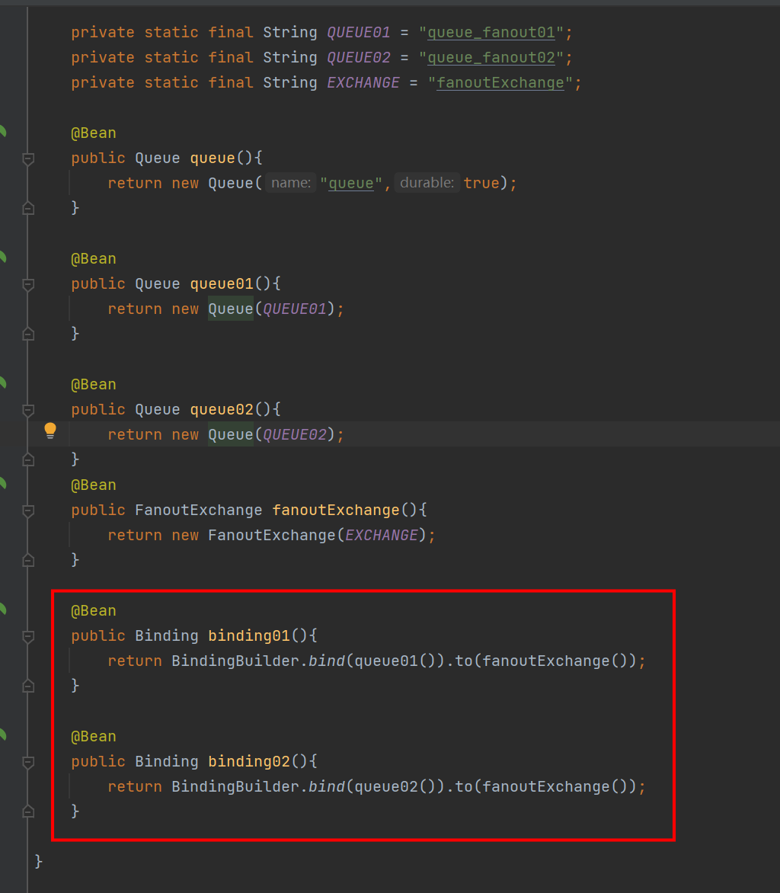

    

  - 配置发送和接收部分
    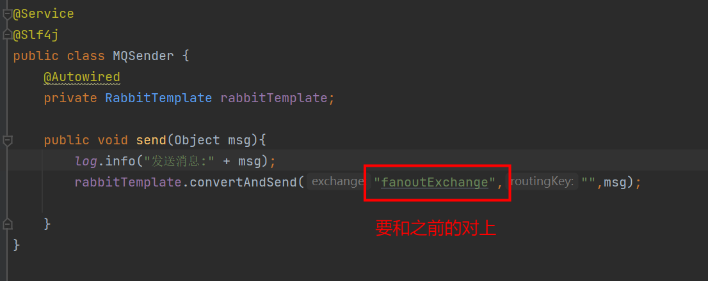
    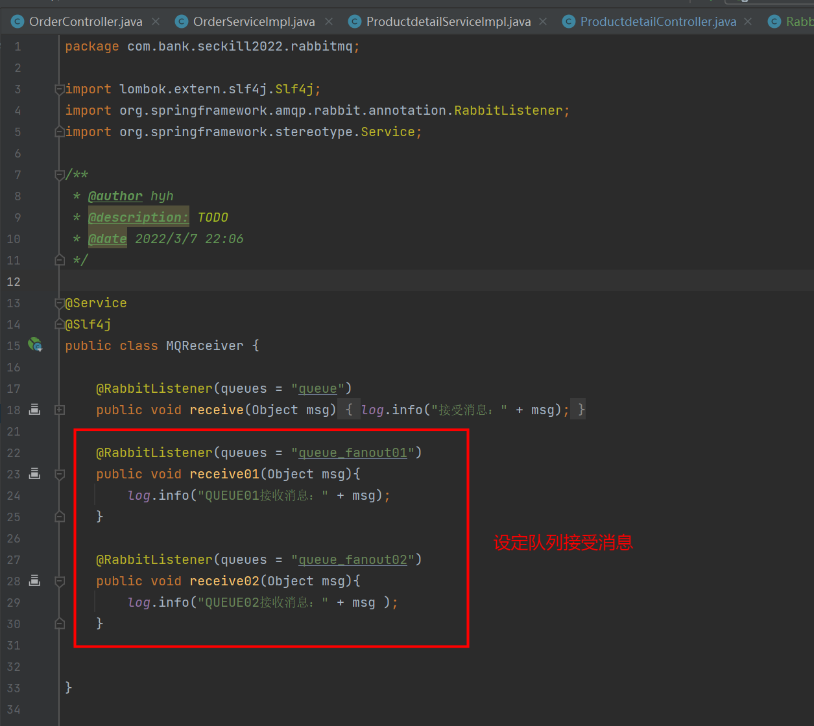
  - 配置Controller层
  - 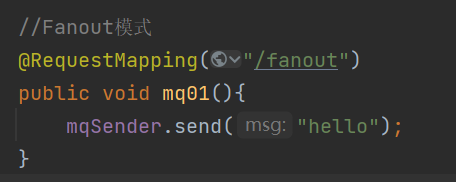

## Direct模式

- 通过绑定交换件的方式让交换机指定转发到某个队列上

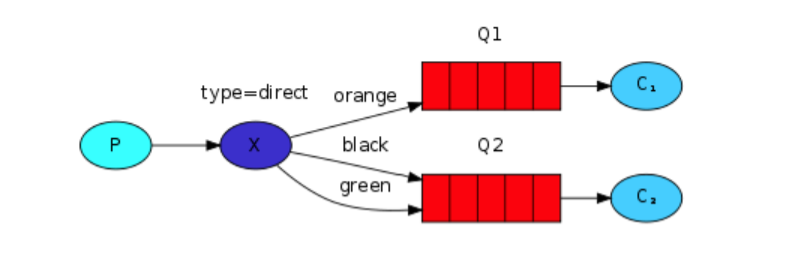

- 所有发送到Direct Exchange的消息被转发到RouteKey中指定的Queue
- 注意：Direct模式可以使用RabbitMQ自带的Exchange：default Exchange,所以不需要将 Exchange进行任何绑定(binding)操作，消息传递时，RouteKey必须完全匹配才会被队列接收，否则该消息会被抛弃。 重点：routing key与队列queues 的key保持一致，即可以路由到对应的queue中。
- 核心代码
  - Config配置类
  - 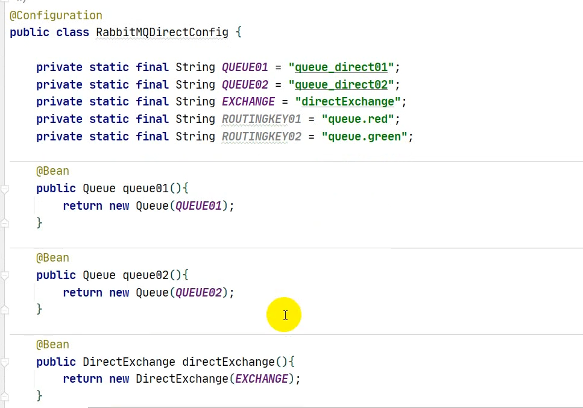
  - 
  - MQSender配置
  - 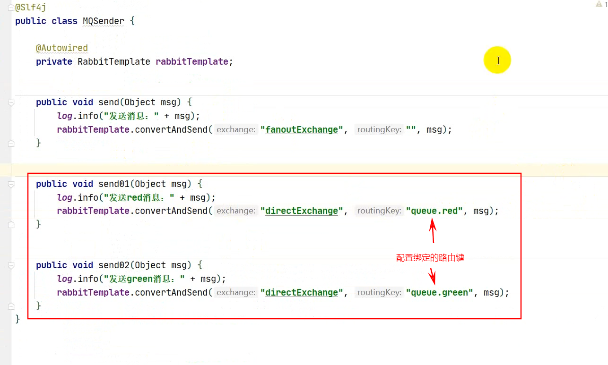
  - MQReceiver配置
  - 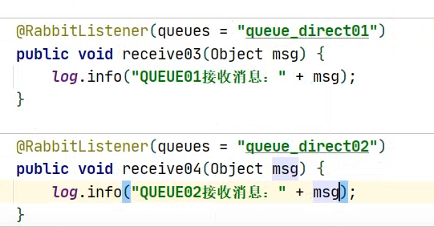
  - Controller配置，记得注入
  - 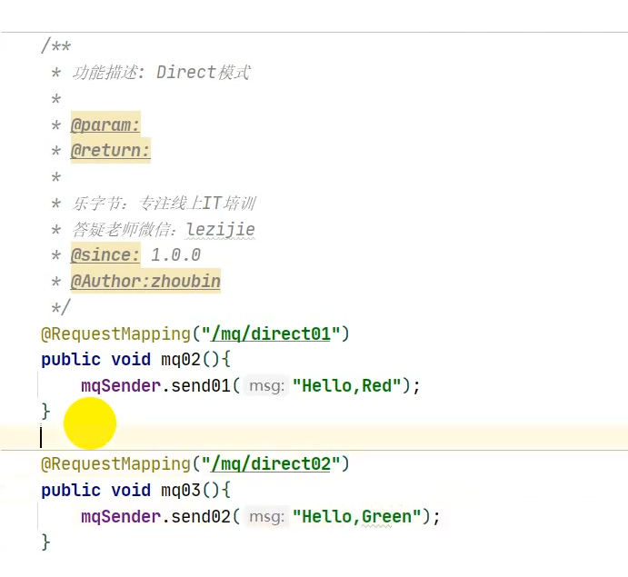
  - **路由键若匹配不到，默认情况会丢失**，但是可以通过对应的配置让他重新发送或者转发到指定的交换机上

## Topic模式

- 简单理解

  - 带有通配符的Direct模式，可以进行类似于模糊匹配和精确匹配路由键。一个都匹配不到默认会丢弃消息。

  - **[ * ]**精确匹配

  - **[ # ]**模糊匹配，后面可以跟一个或者多个单词

  - 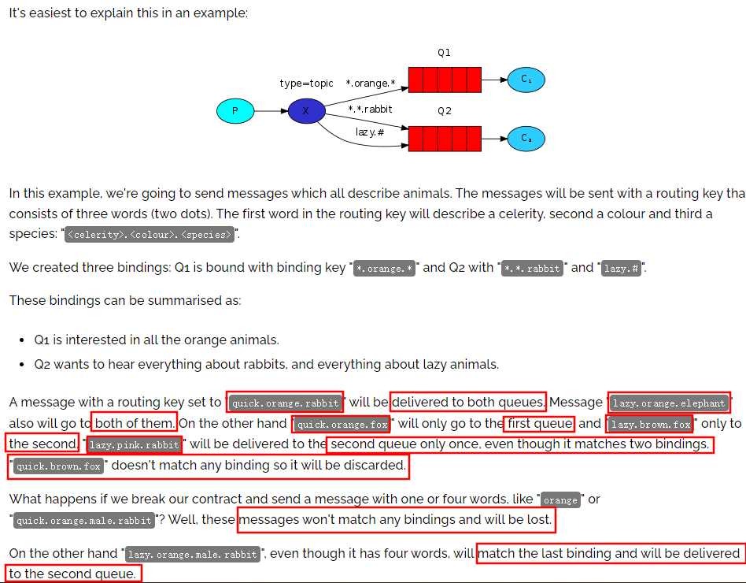

  - 核心代码

    - Config
    - 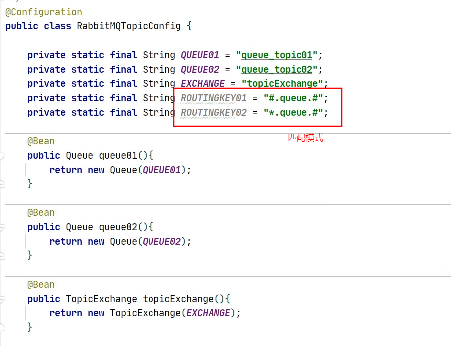
    - 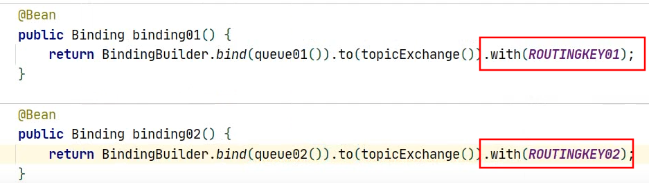
    - Sender配置

    - 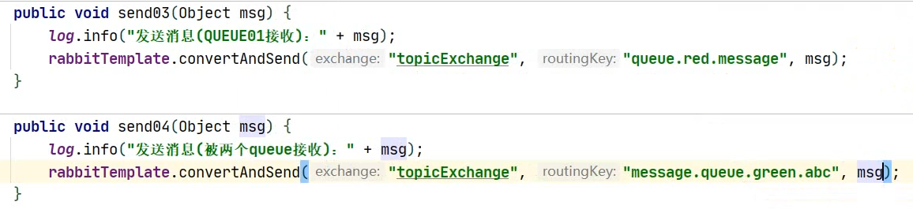
    - Receiver配置
    - 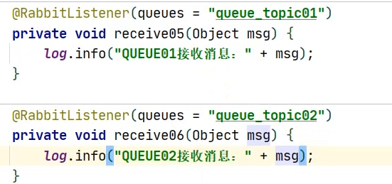
    - Controller配置
    - 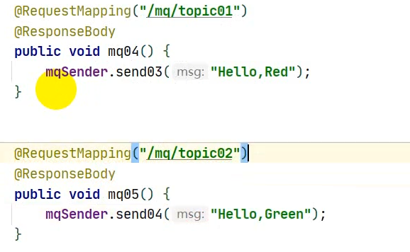
    - 

 

## Header模式
- 简单理解

  - 实际工作中并不常用，简单学习

  - 并不依赖于路由键
  - 用Map匹配机制，效率低

 - 核心代码
   - Config
   - 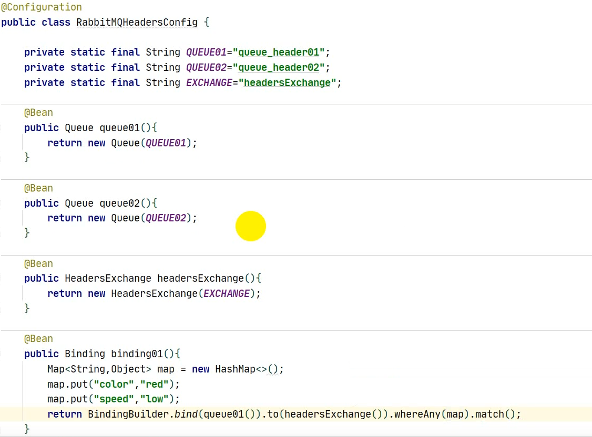
   - 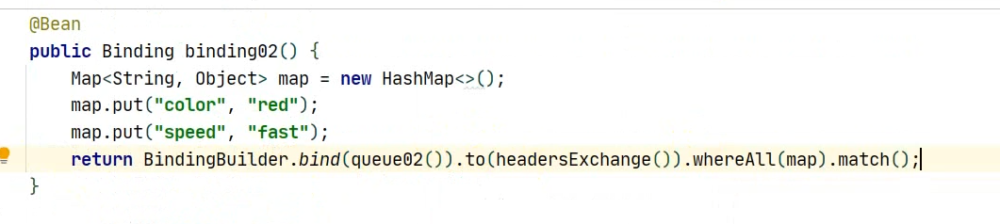
   - MQSender
   - 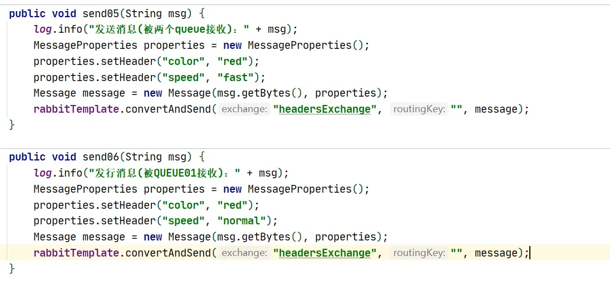
   - MQReceiver
   - 
   - Controller
   - 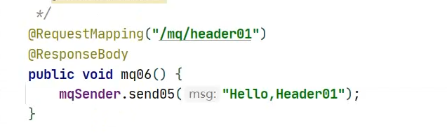
   - 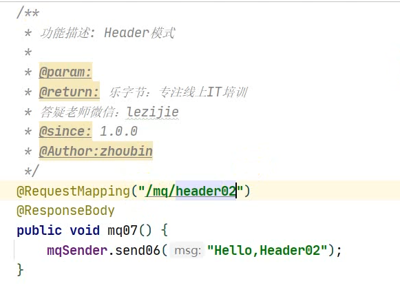

