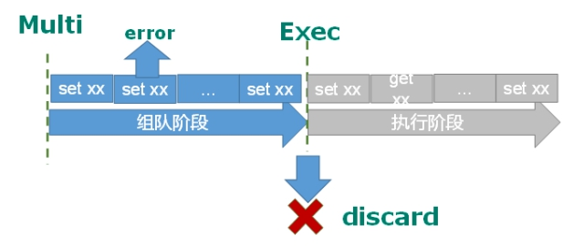
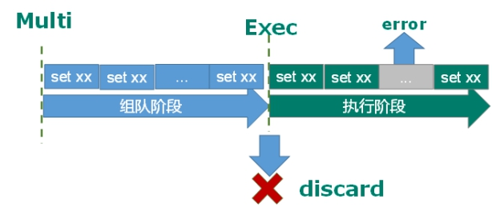

# Redis学习笔记

## 笔记声明
   - 本篇文章是根据视频[【尚硅谷】Redis 6 入门到精通 超详细 教程](https://www.bilibili.com/video/BV1Rv41177Af?p=34&spm_id_from=pageDriver&vd_source=18a2ac72878c53ecc7e029977c1d5d7f)学习得来，参考老师的笔记进行整理

## NoSQL概念
1. NoSQL(Not Only SQL) 泛指非关系型数据库，不依赖业务逻辑方式存储，而以简单的Key-Value方式存储，大大增加了数据库的扩展能力
2. 特点
   1. 不遵循SQL标准
   2. 不支持ACID
        - ACID，是指数据库管理系统（DBMS）在写入或更新资料的过程中，为保证事务（transaction）是正确可靠的，所必须具备的四个特性：原子性（atomicity，或称不可分割性）、一致性（consistency）、隔离性（isolation，又称独立性）、持久性（durability）。
   3. 远超于SQL的性能
3. 适用场景
   1. 对数据高并发的读写
   2. 海量数据读写
   3. 对数据高可扩展性的
4. 不适用场景
   1. 需要事务支持
   2. 基于sql的结构化查询存储，处理复杂的关系，需要即席查询
   3. 用不着sql的和用了sql也不行的情况，考虑用NoSQL 

## Redis基础知识
1. Redis是**单线程+多路IO复用技术**
1. 原子操作
   1. 定义
      1. 不会被线程调度机制打断的操作。一旦开始操作就会一直运行到结束，中间不会有任何线程切换
      2. 在单线程中，能够在单条指令中完成的操作都可以被认为是原子操作，因为中断只能发生于指令之间
      3. 多线程中，不能被其他进程(线程)打断的操作就叫原子操作
2. 常用五大数据类型
   1. 字符串(String)
      1. 一个Key对应一个Value
      2. String类型是二进制安全的，可以包含任何数据。
      3. value最多可以是512M
   2. 列表(List)
      1. 单键多值
      2. 可以添加一个元素到列表的头部或者尾部
      3. 底层实际是个双向链表，两端操作性能高，但是中间低
      4. 值在键在，值光键亡
      5. 数据结构为快速链表 数据量较少情况下分配一块连续的内存以ziplist(压缩列表)来进行存储，多起来就是ziplist+链表=quicklist，也就是将多个ziplist用双向指针串起来。
   3. 集合(Set)
      1. **自动排重**
      2. 是String类型的无序集合，底层其实是一个value为null的hash表，添加、删除、查找复杂度都是**O(1)**
      3. 数据结构是dict字典，字典是用哈希表实现的
   4. 哈希(Hash)
      1. 是一个键值对集合
      2. 是一个String类型的field和value的映射表，特别适合用于存储对象
      3. Hash类型对应的数据结构是两种：ziplist（压缩列表），hashtable（哈希表）。当field-value长度较短且个数较少时，使用ziplist，否则使用hashtable。
   5. 有序集合(Zset)
      1. 是一个**没有重复元素**的字符串集合
      2. 与set相似，不同的是有序集合的每个成员都关联了一个评分(score)，被用来按照从最低分到最高分排序。集合成员**唯一**但是评分可以重复
      3. 可以用来实现一个排行榜，等价于Java的Map<String, Double>，可以给每个元素value赋予一个权重score，另一方面它又类似于TreeSet，内部的元素会按照权重score进行排序，可以得到每个元素的名次，还可以通过score的范围来获取元素的列表。
      4. 底层使用了hash和跳跃表
3. Redis6的发布和订阅
   1. 是什么
        - 发布订阅(pub/sub)是一种消息通信模式，发送者发送消息，订阅者接受消息
   2. 流程图
        
        
4. Redis新数据类型
   1. Bitmaps
      1. Redis提供了Bitmaps这个"数据类型"可以实现对位的操作
      2. Bitmaps本身不是一种数据类型， 实际上它就是字符串（key-value） ， 但是它可以对字符串的位进行操作。
      3. 可以用来统计每日网站的访问用户
      4. Bitmaps单独提供了一套命令， 所以在Redis中使用Bitmaps和使用字符串的方法不太相同。 可以把Bitmaps想象成一个以位为单位的数组， 数组的每个单元只能存储0和1， 数组的下标在Bitmaps中叫做偏移量。
    
   2.  HyperLogLog
        1. 是用来做基数统计的算法(基数-比如数据集{1,3,5,7,5,7,8}，基数集就是{1,3,5,7,8}，基数为5)
   3. Geospatial
      1. Redis 3.2 中增加了对GEO类型的支持。GEO，Geographic，地理信息的缩写。 该类型，就是元素的2维坐标，在地图上就是经纬度。redis基于该类型，提供了经纬度设置，查询，范围查询，距离查询，经纬度Hash等常见操作。
5. Redis事务
   1. Redis事务是一个单独的隔离操作
       - 事务中的所有命令都会序列化，按顺序地执行。事务在执行的过程中，不会被其他客户端发送来的命令请求所打断
   2. 事务的主要作用就是串联多个命令防止插队
   3. **Redis事务与SQL里的事务概念不同，注意别混淆**
   4. Multi、Exec、discard
       1.  从输入Multi命令开始，输入的命令都会依次进入命令队列中，但不会执行，直到输入Exec后，Redis会将之前的命令队列中的命令依次执行。组队的过程中可以通过discard来放弃组队。  
   5. 事务的错误处理
      1. 组队中某个命令出现了报告错误，执行时整个的所有队列都会被取消。
        
      2. 如果执行阶段某个命令报出了错误，则只有报错的命令不会被执行，而其他的命令都会执行，不会回滚。
        
   6. 悲观锁
      1. 悲观锁(Pessimistic Lock), 顾名思义，就是很悲观，每次去拿数据的时候都认为别人会修改，所以每次在拿数据的时候都会上锁，这样别人想拿这个数据就会block直到它拿到锁。传统的关系型数据库里边就用到了很多这种锁机制，比如行锁，表锁等，读锁，写锁等，**都是在做操作之前先上锁**。
      
   7. 乐观锁
      1. 乐观锁(Optimistic Lock), 顾名思义，就是很乐观，每次去拿数据的时候都认为别人不会修改，所以不会上锁，但是在更新的时候会判断一下在此期间别人有没有去更新这个数据，可以使用版本号等机制。**乐观锁适用于多读的应用类型，这样可以提高吞吐量。**Redis就是利用这种check-and-set机制实现事务的。
      
   8. WATCH key [key ...]
      1. 在执行multi之前，先执行watch可以监视一个(或多个) key ，如果在事务执行之前这个(或这些) key 被其他命令所改动，那么事务将被打断。
   9. **Redis事务三特性**
      1.  单独的隔离操作
          1.  事务中的所有命令都会序列化、按顺序地执行。事务在执行的过程中，不会被其他客户端发送来的命令请求所打断。
      2.  没有隔离级别的概念
          1.  队列中的命令没有提交之前都不会被实际执行，因为事务提交前任何指令都不会被实际执行。
      3.  不保证原子性
          1.  事务中如果有一条命令执行失败，其他命令仍然会被执行，没有回滚。例如在队列中的情况。
6.  Redis持久化
    1. RDB(Redis Database)
       1. 是什么
          1. 在指定的时间间隔内将内存中的数据集快照写入磁盘， 也就是行话讲的Snapshot快照，它恢复时是将快照文件直接读到内存里
       2. 过程
          1. Redis会单独创建（fork）一个子进程来进行持久化，会先将数据写入到 一个临时文件中，待持久化过程都结束了，再用这个临时文件替换上次持久化好的文件。 整个过程中，主进程是不进行任何IO操作的，这就确保了极高的性能 如果需要进行大规模数据的恢复，且对于数据恢复的完整性不是非常敏感，那RDB方式要比AOF方式更加的高效。**RDB的缺点是最后一次持久化后的数据可能丢失。**
          2. Fork
             1. 复制一个与当前进程一样的进程。新进程的所有数据数值都和原进程一致，但是是一个全新的进程，**并作为原进程的子进程**
             2. 一般情况父进程和子进程**共用一段物理内存**。只有进程空间的各段的内容要发生变化时，才会将父进程的内容复制一份给子进程。
             3. 写时复制技术
               - 写时拷贝的主要作用就是将拷贝推迟到写操作真正发生时，这也就避免了大量无意义的拷贝操作。
               - 在 Redis 服务中，子进程只会读取共享内存中的数据，它并不会执行任何写操作，只有父进程会在写入时才会触发这一机制，而对于大多数的 Redis 服务或者数据库，写请求往往都是远小于读请求的，所以使用 fork 加上写时拷贝这一机制能够带来非常好的性能，也让 BGSAVE 这一操作的实现变得非常简单。
       3. 优势
          1. 适合大规模的数据恢复
          2. 对数据完整性和一致性要求不高更适合使用
          3. 节省磁盘空间
          4. 恢复速度快
       4. 劣势
          1. 要考虑2倍膨胀性带来的空间
          2. 虽然有写时拷贝技术但是如果数据庞大时还是比较消耗性能
          3. 在写一定间隔时间做备份，如果Redis意外宕机会丢失最后一次快照后的所有更改
         
    2. AOF（Append Only File）
       1. 是什么
          1. 以**日志的形式来记录每个写操作***（增量保存）*，将Redis执行过的所有写指令记录下来(读操作不记录)， **只许追加文件但不可以改写文件**，redis启动之初会读取该文件重新构建数据，换言之，redis 重启的话就根据日志文件的内容将写指令从前到后执行一次以完成数据的恢复工作
       2. 流程
          1. 客户端的请求写命令会被append追加到AOF缓冲区内
          2. AOF缓冲区根据AOF持久化策略\[always,everysec,no\]将操作sync同步到磁盘的AOF文件中
          3. AOF文件大小超过重写策略或手动重写时，会对AOF文件rewrite重写，压缩AOF文件容量
          4. Redis服务重启时，会重新load加载AOF文件中的写操作达到数据恢复的目的
       3. Rewrite压缩
          1. 是什么
             1. AOF采用文件追加方式，文件会越来越大，为避免出现此种情况，新增了重写机制, 当AOF文件的大小超过所设定的阈值时，Redis就会启动AOF文件的内容压缩， 只保留可以恢复数据的最小指令集.可以使用命令bgrewriteaof
          2. 原理
             1. 把rdb 的快照，以二级制的形式附在新的aof头部，作为已有的历史数据，替换掉原来的流水账操作。
          3. 流程
             1. bgrewriteaof触发重写，判断是否当前有bgsave或bgrewriteaof在运行，如果有，则等待该命令结束后再继续执行。
             2. 主进程fork出子进程执行重写操作，保证主进程不会阻塞。
             3. 子进程遍历redis内存中数据到临时文件，客户端的写请求同时写入aof_buf缓冲区和aof_rewrite_buf重写缓冲区保证原AOF文件完整以及新AOF文件生成期间的新的数据修改动作不会丢失。
             4. 子进程写完新的AOF文件后，向主进程发信号，父进程更新统计信息。主进程把aof_rewrite_buf中的数据写入到新的AOF文件。
             5. 使用新的AOF文件覆盖旧的AOF文件，完成AOF重写。
             
       4. 优势
          1. 备份机制更稳健，丢失数据概率更低。
          2. 可读的日志文本，通过操作AOF稳健，可以处理误操作。
       5. 劣势
          1. 比起RDB占用更多的磁盘空间。
          2. 恢复备份速度要慢。
          3. 每次读写都同步的话，有一定的性能压力。
          4. 存在个别Bug，造成恢复不能。
    3.  AOF和RDB同时开启，系统默认取AOF的数据（数据不会存在丢失）
    4. 总结
   

7. Redis主从复制
   1. 是什么
      1. 主机数据更新后根据配置和策略， 自动同步到备机的master/slaver机制，Master以写为主，Slave以读为主
   2. 作用
      1. **读写分离，性能扩展**
      2. **容灾快速恢复**
   3. 复制原理
      1. Slave启动成功连接到master后会发送一个sync命令
      2. Master接到命令启动后台的存盘进程，同时收集所有接收到的用于修改数据集命令， 在后台进程执行完毕之后，master将传送整个数据文件到slave,以完成一次完全同步
      3. 全量复制：而slave服务在接收到数据库文件数据后，将其存盘并加载到内存中。
      4. 增量复制：Master继续将新的所有收集到的修改命令依次传给slave,完成同步
      5. 但是只要是重新连接master,一次完全同步（全量复制)将被自动执行
      
   4. 常用方法
      1. 一主二仆
         1. 一般是一台主机两台从机，从机挂掉在启动，若未配置关联则会失效，若配置了会完全复制主机内容。
         2. 从机只可读不可写
         3. 主机挂掉，从机原地待命
      2. 薪火相传
         1. 上一个Slave可以是下一个Slave的Master，Slave同样可以接受其他Slaves的连接和同步请求，可以有效减轻Master的写压力，去中心化，降低风险。
      3. 反客为主
         1. 当一个Master宕机后，后面的Slave可以立刻升为Master，其后面的Slave不用做任何修改。
   5. 哨兵模式
      1. 是什么
         1. 反客为主的自动版，能够后台监控主机是否故障，如果故障了根据投票数自动将从库转换为主库
         
      2. 配置
         1. 自定义的/myredis目录下新建sentinel.conf文件，名字绝不能错
         2. 配置文件sentinel monitor mymaster 127.0.0.1 6379 1 其中mymaster为监控对象起的服务器名称， 1 为至少有多少个哨兵同意迁移的数量。
         3. 故障恢复过程
            - 优先级在redis.conf中默认：slave-priority 100，值越小优先级越高
            - 偏移量是指获得原主机数据最全的
            - 每个redis实例启动后都会随机生成一个40位的runid
         
  
   6. Redis集群
      1. 是什么
         1. Redis 集群实现了对Redis的水平扩容，即启动N个redis节点，将整个数据库分布存储在这N个节点中，每个节点存储总数据的1/N。Redis 集群通过分区（partition）来提供一定程度的可用性（availability）: 即使集群中有一部分节点失效或者无法进行通讯， 集群也可以继续处理命令请求。
         2. 分配原则尽量保证每个主数据库运行在不同的IP地址，每个从库和主库不在一个IP地址上。
         3. 之前通过代理主机来解决，但是redis3.0中提供了解决方案。就是**无中心化集群配置**。
      2. 什么是Slots
         1. 一个 Redis 集群包含 16384 个插槽（hash slot），数据库中的每个键都属于这 16384 个插槽的其中一个，集群使用公式 CRC16(key) % 16384 来计算键 key 属于哪个槽，其中 CRC16(key) 语句用于计算键 key 的 CRC16 校验和 。集群中的每个节点负责处理一部分插槽。举个例子，如果一个集群可以有主节点，其中：节点 A 负责处理 0 号至 5460 号插槽。节点 B 负责处理 5461 号至 10922 号插槽。节点 C 负责处理 10923 号至 16383 号插槽。
         2. 流程
            1. 在redis-cli每次录入、查询键值，redis都会计算出该key应该送往的插槽，如果不是该客户端对应服务器的插槽，redis会报错，并告知应前往的redis实例地址和端口。redis-cli客户端提供了 –c 参数实现自动重定向。
            2. 不在一个slot下的键值，**是不能使用mget,mset等多键操作**
      3. 故障恢复
         1. 主节点下线，从节点自动升为主节点
         2. 下线的主节点恢复之后变成从机
         3. 如果某一段插槽的主从都挂掉，而cluster-require-full-coverage 为yes ，那么 ，整个集群都挂掉
         4. 如果某一段插槽的主从都挂掉，而cluster-require-full-coverage 为no ，那么，该插槽数据全都不能使用，也无法存储。
      4. 优势
         1. 实现扩容
         2. 分摊压力
         3. 无中心配置相对简单
      5. 劣势
         1. 多键操作不被支持
         2. 多键的Redis事务不被支持，lua脚本不被支持
         3. 由于集群方案出现较晚，很多公司已经采用了其他的集群方案，而代理或者客户端分片的方案想要迁移至redis cluster，需要整体迁移而不是逐步过渡，复杂度较大。
## 可能会遇到的问题
1. 缓存穿透
   1. 情景
      1. 应用服务器压力剧增，查询缓存中不存在的数据，到数据库里查
      2. Redis命中率降低
      3. 一直查询数据库，数据库崩溃
      
   2. 解决方案
      1. 对空值缓存
      2. 设置可访问的名单（白名单）
      3. 采用布隆过滤器
      4. 进行实时监控
      5. 报警
2. 缓存击穿
   1. 情景
      1. 数据库访问压力瞬时增加
      2. Redis里没有出现大量Key过期
      3. Redis正常运行
      4. Redis某个Key过期了，但是突然大量访问了这个Key
      5. 数据库崩溃
   2. 解决方案
      1. 预先设置热门数据，加大过期时间
      2. 实时调整
      3. 使用锁
         1. 就是在缓存失效的时候（判断拿出来的值为空），不是立即去load db。
         2. 先使用缓存工具的某些带成功操作返回值的操作（比如Redis的SETNX）去set一个mutex key
         3. 当操作返回成功时，再进行load db的操作，并回设缓存,最后删除mutex key
         4. 当操作返回失败，证明有线程在load db，当前线程睡眠一段时间再重试整个get缓存的方法。
         
3. 缓存雪崩
   1. 情景
      1. 数据库压力变大
      2. 大量Key缓存同一时间段过期
      
      
   2. 解决方案
      1. 构建多级缓存架构：Nginx缓存+Redis缓存+其他缓存
      2. 使用锁或队列保证不会有大量线程对数据库一次性进行读写
      3. 设置过期标志更新缓存，过期触发通知另外的线程去更新实际Key的缓存
      4. 将缓存失效时间分散开，设置随机失效时间
4. 分布式锁
   1. 主流方案
      1. 基于数据库实现分布式锁
      2. 基于缓存（Redis等） 性能最高
      3. 基于Zookeeper 可靠性最高
   2. Redis解决方案
      1. 同时设置键值和过期时间，所有访问操作都需要获取这个键，没获取到就要等待重试。但是不优化的话有问题，可能会释放其他服务器的锁。
      
      
      2. 进一步优化： 键取值设置UUID，取的时候对比是不是存的时候的，同时使用lua脚本保证原子性，防止特殊情况下的误删
   3. 确保分布式锁可用必须满足的四个条件
      1. 互斥性。在任意时刻，只有一个客户端能持有锁。
      2. 不会发生死锁。即使有一个客户端在持有锁的期间崩溃而没有主动解锁，也能保证后续其他客户端能加锁。
      3. 加锁和解锁必须是同一个客户端，客户端自己不能把别人加的锁给解了。
      4. 加锁和解锁必须具有原子性。
## Redis6主要新特性
1. Redis ACL是Access Control List（访问控制列表）的缩写，该功能允许根据可以执行的命令和可以访问的键来限制某些连接。
2. 支持IO多线程。IO多线程其实指客户端交互部分的网络IO交互处理模块多线程，而非执行命令多线程。**Redis6执行命令依然是单线程。**