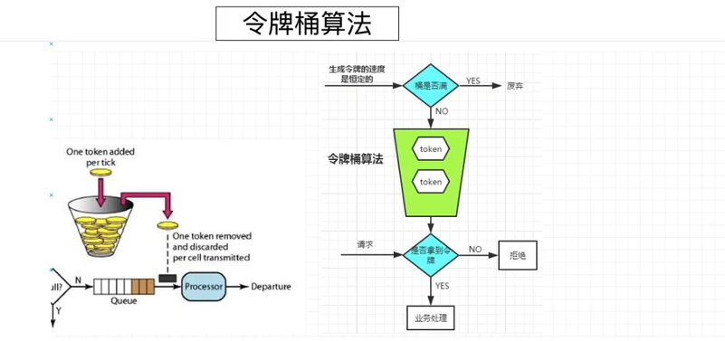

# 令牌桶限流算法

- 令牌桶原理

  - 
  - 最初来源于计算机网络。在网络传输数据时，为了防止网络拥塞，需限制流出网络的流量，使流量以比较均匀的速度向外发送。
  - 牌桶算法就实现了这个功能，可控制发送到网络上数据的数目，并允许突发数据的发送。大小固定的令牌桶**可自行以恒定的速率源源不断地产生令牌**。如果令牌不被消耗，或者被消耗的速度小于产生的速度，令牌就会**不断地增多，直到把桶填满**。后面再产生的令牌就会从桶中溢出。最后桶中可以保存的最大令牌数永远不会超过桶的大小。这意味，面对瞬时大流量，该算法可以在短时间内请求拿到大量令牌，而且拿令牌的过程并不是消耗很大的事情。

- 后端操作步骤

  - 引入依赖

    ```java
    <dependency>
       <groupId>com.google.guava</groupId>
       <artifactId>guava</artifactId>
       <version>28.2-jre</version>
    </dependency> 
    ```

  - 基本使用

    ```java
    //创建令牌桶实例，写10代表每秒放行十个请求
    private RateLimiter rateLimiter = RateLimiter.create(40);
    
    @PostMapping("sale")
    public String sale(Integer id){
        //可采用的策略
        //1.没有获取到token请求就一直等，直到获取到token
        log.info("等待的时间：" + rateLimiter.acquire());
        //2.设置一个等待时间,如果在等待的时间内获取到了token令牌，则处理业务，如果没有获取到则抛弃，不继续处理业务
        //如果超时还没拿到
        if(!rateLimiter.tryAcquire(2,TimeUnit.SECONDS)){
            System.out.println("请求被限流，无法调用后续逻辑");
            return "抢购失败";
        }
        //处理业务代码省略
        return "抢购成功";
    }
    ```

  - 

  - 